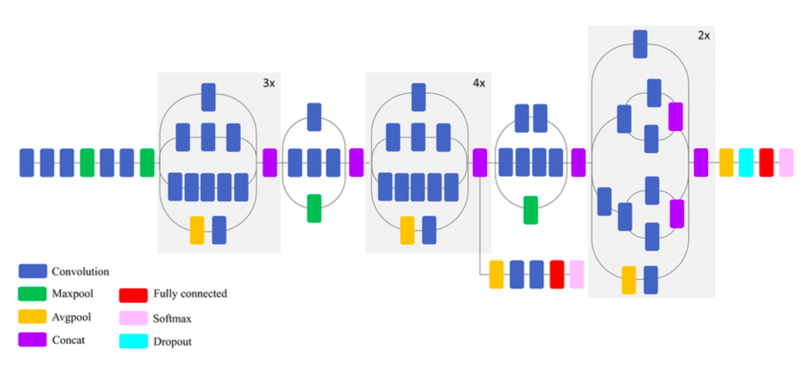
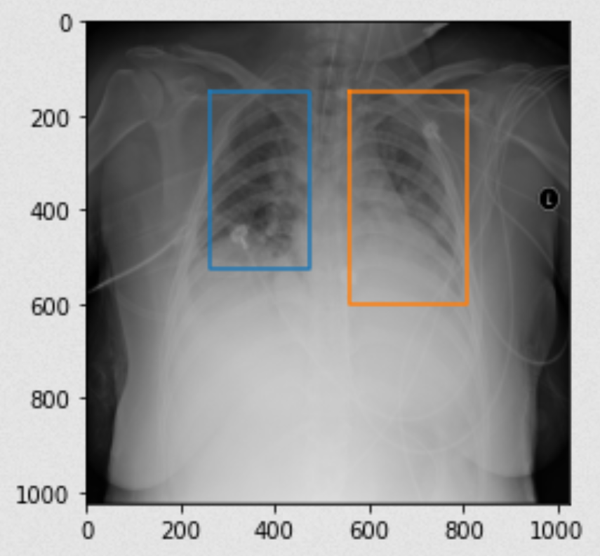

# Cancer-and-Tumor-Detection-Using-Inception-model
In this repo i am gonna show you how i did cancer/tumor detection in lungs using deep neural networks, specifically here the Inception model by google.

# Model Chosen - Inception V3 Architecture

# Localisation example

Notebook contains text that guides through the project.

# Thank you.
